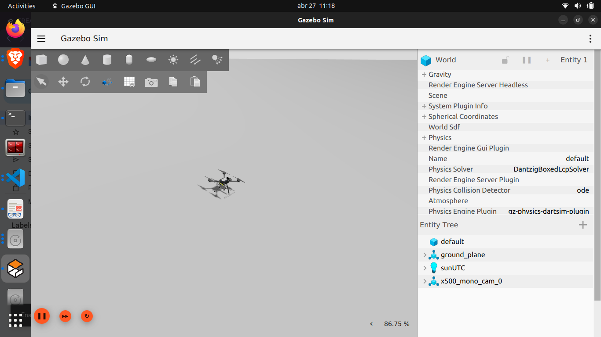

# ⚙️ Instalação dos softwares para simulação

# Pré-requisitos

- Ubuntu 22.04.5 LTS

# Passo-a-passo

### Passo 1: Preparar o Sistema e Instalar ROS 2 Humble

O ROS 2 é a base de comunicação. Vamos instalar a versão padrão para o Ubuntu 22.04.

1. Atualize o sistema e instale ferramentas básicas:
    
    Abra o terminal (Ctrl+Alt+T) e rode:
    
    ```bash
    sudo apt update && sudo apt upgrade -y
    sudo apt install curl gnupg2 lsb-release git wget -y
    ```
    
2. **Adicione a chave e o repositório do ROS 2:**
    
    ```bash
    sudo curl -sSL https://raw.githubusercontent.com/ros/rosdistro/master/ros.key -o /usr/share/keyrings/ros-archive-keyring.gpg
    
    echo "deb [arch=$(dpkg --print-architecture) signed-by=/usr/share/keyrings/ros-archive-keyring.gpg] http://packages.ros.org/ros2/ubuntu $(source /etc/os-release && echo $UBUNTU_CODENAME) main" | sudo tee /etc/apt/sources.list.d/ros2.list > /dev/null
    ```
    
3. **Instale o ROS 2 Humble e ferramentas de desenvolvimento:**
    
    ```bash
    sudo apt update
    sudo apt install ros-humble-desktop ros-dev-tools -y
    ```
    
4. **Configure o ambiente para carregar sempre:**
    
    ```bash
    echo "source /opt/ros/humble/setup.bash" >> ~/.bashrc
    source ~/.bashrc
    ```
    

### Passo 2: Instalar o PX4 Autopilot e o Gazebo

O PX4 fornece um script mágico que instala todas as dependências de simulação (incluindo o Gazebo Harmonic) para você.

1. **Baixe o código do PX4 (na pasta home):**
    
    ```bash
    cd ~
    git clone https://github.com/PX4/PX4-Autopilot.git --recursive
    ```
    
2. Execute o script de instalação automática:
    
    Atenção: Este passo vai pedir sua senha de sudo algumas vezes e vai demorar um pouco.
    
    ```bash
    cd ~/PX4-Autopilot/Tools/setup
    bash ubuntu.sh
    ```
    
    *(Nota: Se o script perguntar sobre opções, geralmente o padrão é seguro).*
    
3. IMPORTANTE: Reinicie o computador.
    
    O script acima adiciona permissões de usuário que só funcionam após reiniciar.
    
    ```bash
    sudo reboot
    ```
    

### Passo 3: Compilar a Ponte (Bridge) Customizada

*Aqui é onde evitamos o erro de versão.* Como o PX4 instalou o **Gazebo Harmonic (v8)** e o ROS 2 Humble espera o **Fortress (v6)**, vamos compilar a ponte manualmente.

1. **Crie o Workspace:**
    
    ```bash
    mkdir -p ~/ros_gz_ws/src
    cd ~/ros_gz_ws/src
    ```
    
2. **Baixe o código fonte da ponte (versão Humble):**
    
    ```bash
    git clone -b humble https://github.com/gazebosim/ros_gz.git
    ```
    
3. **Instale as dependências (Forçando Harmonic):**
    
    ```bash
    cd ~/ros_gz_ws
    export GZ_VERSION=harmonic
    
    sudo rosdep init
    # Se der erro de "já existe", ignore
    
    rosdep update
    rosdep install -r --from-paths src -i -y --rosdistro humble
    ```
    
4. Compile (Modo seguro para não travar o PC):
    
    Este comando desativa os testes (que ocupam muito espaço) e compila um arquivo por vez.
    
    ```bash
    export GZ_VERSION=harmonic
    colcon build --cmake-args -DBUILD_TESTING=OFF -DCMAKE_BUILD_TYPE=Release --parallel-workers 1
    ```
    
5. Adicione a ponte ao seu ambiente automático:
    
    Para você não ter que digitar source toda vez:
    
    ```bash
    echo "source ~/ros_gz_ws/install/setup.bash" >> ~/.bashrc
    echo "export GZ_VERSION=harmonic" >> ~/.bashrc
    source ~/.bashrc
    ```
    

### Passo 4: Instalar dependências Python do PX4

Para garantir que o PX4 consiga conversar com o ROS 2 (Agente MicroXRCE), instale:

```bash
cd ~
git clone https://github.com/eProsima/Micro-XRCE-DDS-Agent.git
cd Micro-XRCE-DDS-Agent
mkdir build && cd build
cmake ..
make
sudo make install
sudo ldconfig /usr/local/lib/
```

### Passo 5: Testando a simulação

Agora seu sistema está pronto. Vamos testar a simulação. Assim, basta rodar no terminal.


```bash
cd ~/PX4-Autopilot
make px4_sitl gz_x500_mono_cam
```

*(Espere o Gazebo abrir e o drone aparecer)*


